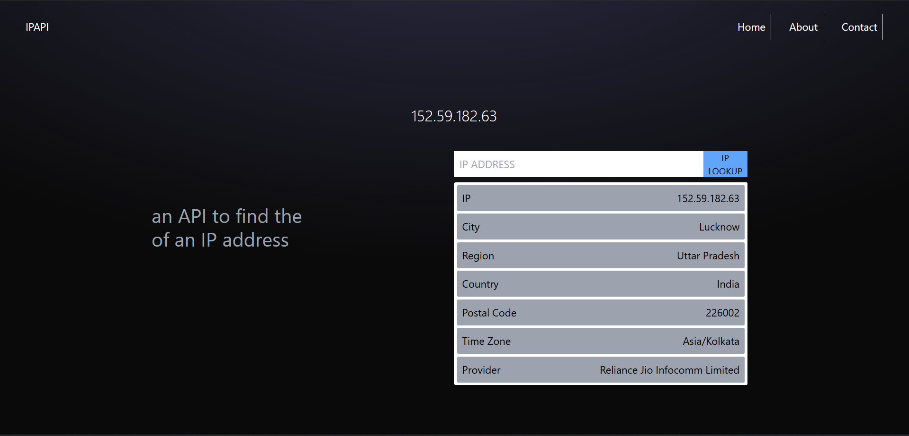

# 🌍 IP Geolocation App (ipapi.co Clone)

A simple and elegant IP Geolocation web application built with **React** and **Tailwind CSS** that fetches real-time IP address information using a public IP API. Users can view their own IP data or look up any custom IP address.

## 🚀 Features

- 🌐 Auto-detects and displays your IP location info
- 🔍 Search and get geolocation for any IP address
- 🖥️ Built with **React** and styled using **Tailwind CSS**
- 📡 Data fetched from IP geolocation API (like `ipapi.co` or any compatible service)

## 📸 Demo

> Add a live link if hosted or include a GIF/screenshot



## 🛠️ Tech Stack

- ⚛️ React
- 🎨 Tailwind CSS
- 🌍 IP Geolocation API (like `https://ipapi.co/json/` or any valid endpoint)

## 📦 Installation

```bash
git clone https://github.com/your-username/ipapi-clone.git
cd ipapi-clone
npm install
npm run dev
